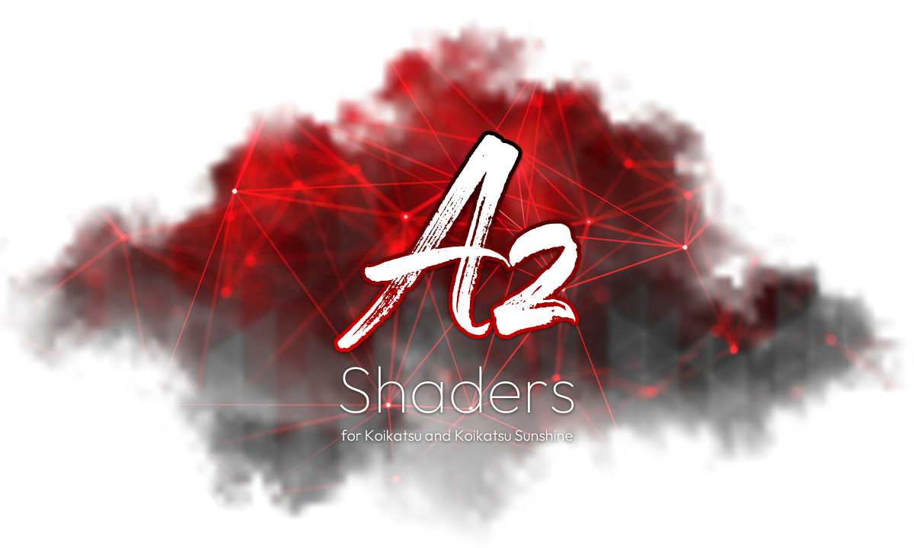

# Welcome to Az shaders document

- [Welcome to Az shaders document](#welcome-to-az-shaders-document)
  - [Live](#live)
  - [Draft](#draft)
  - [General information](#general-information)
    - [Texture maps color space](#texture-maps-color-space)
    - [Explicit default](#explicit-default)
    - [Consistency with Unity Standard shader](#consistency-with-unity-standard-shader)
    - [Shader type](#shader-type)
    - [Shader keyword support](#shader-keyword-support)
    - [Property category support](#property-category-support)
  - [Tutorials](#tutorials)
  - [Notes](#notes)

This is the complete documentation for Az shaders: the shaders created by Acezen for Koikatsu and Koikatsu Sunshine.

## Live
- [Az Matcap shaders](az_matcap/README.md)
- [Az Unlit shaders](az_unlit/README.md)
- [Az Standard shaders](az_standard/README.md)
- [Az Fur shader](az_fur/README.md)
- [Az Planar Reflection shaders](az_planar_reflection/README.md)

You can find the mods containing these shaders on my Patreon: https://www.patreon.com/AcezenMod.

## Draft
- [Az Advanced shaders](az_advanced/README.md)
- [Az Anisotropic shaders](az_anisotropic/README.md)
- [Az Subsurface shaders](az_subsurface/README.md)

## General information
### Texture maps color space
Since users can only import textures in gamma color space, limited by Material Editor, but many Az shaders can convert texture color space internally, that is, the textures are imported in gamma color space, but will be processed as in linear color space.

To save space and maintain a neat layout, the color space is abbreviated and appended to the texture type instead of using a separate column.

**Texture2D(G)**: `Texture2D` in gamma color space

**Texture2D(L)**: `Texture2D` in linear color space

The color space labeling of textures serves as a reference during texture creation, as the color space itself plays an important role in rendering. Because gamma and linear color spaces have different value gradients, using textures with a wrong color space may result in unintended visual outcomes.

### Explicit default
Shader properties themselves have internal default values, which are not visible externally. When a property is not assigned, that value is used. This is called "implicit default".

While the shader manifest of Material Editor also allows shader authors to define default values for specific shader properties externally. When switching to that shader, those properties will be assigned the corresponding values. This is called "explicit default".  
SSince this assignment is enforced by Material Editor when switching shaders, such default values are clearly marked as *explicit* as a reminder.

### Consistency with Unity Standard shader
When Az shaders have exactly the same lighting result as Unity Standard shader?
In Az shaders that use Standard (isotropic BRDF) model, if they have the following properties, their values should be:

*Lighting properties*
- `ShadowIntensity`: 1
- `DirectDiffuseIntensity`: 1
- `DirectSpecularIntensity`: 1
- `IndirectDiffuseIntensity`: 1
- `IndirectSpecularIntensity`: 1
- `ShadowTransitionPower`: 0
- `DummyAmbient`: (0,0,0,1)
- `SampleFullSHPerPixel`: `false`

*PBR properties*
- `Metallic`: $Metallic_{\text{Unity Standard}}={Metallic_{\text{Az}}}^\frac{1}{2.2}$ or $Metallic_{\text{Az}}={Metallic_{\text{Unity Standard}}}^{2.2}$.

### Shader type
Most Az shaders include specific Koikatsu game features, giving them types that suggest their intended use. These types appear as suffixes in the shader names. Most of the shader types listed below are derived from the game’s original shaders.

| Shader type      | Potential renderers                    | Typical game shader                   |
| ---------------- | -------------------------------------- | ------------------------------------- |
| Skin             | Body, face                             | `Shader Forge/main_skin`              |
| Subpart          | Tooth, tongue, genital, etc.           | -                                     |
| Eye              | Eye                                    | `Shader Forge/toon_eye_lod0`          |
| EyeW             | Eye white, Eyebrow, Eyeline, Nose line | `Shader Forge/toon_eyew_lod0`         |
| Hair             | Hair, front hair*                      | `Shader Forge/main_hair`              |
| HairFront        | Front hair                             | `Shader Forge/main_hair_front`        |
| ItemCutout       | Item, studio item*                     | `Shader Forge/main_item`              |
| ItemAlpha        | Item, studio item*                     | -                                     |
| ItemStudioCutout | Studio item                            | `Shader Forge/main_item_studio`       |
| ItemStudioAlpha  | Studio item                            | `Shader Forge/main_item_studio_alpha` |
| ClothCutout      | Clothing                               | `Shader Forge/main_opaque`            |
| ClothAlpha       | Clothing                               | `Shader Forge/main_alpha`             |
| LiteCutout       | Item, studio item, clothing            | -                                     |
| LiteAlpha        | Item, studio item, clothing            | -                                     |

*: Some shaders support multiple renderers simultaneously to reduce the number of shaders.

### Shader keyword support
To use certain Az shaders without issues, you need to update your Material Editor to v3.3.0 or later. This is because some Az shaders rely on shader keywords, which are only supported in newer versions of the Material Editor. If you use these shaders in an older version of Material Editor, you may get an error that Material Editor fails and other shader mods cannot be loaded.

### Property category support
It is recommended to use Material Editor v3.12.0 or later to display the property categories of certain Az shaders. Additionally, by disabling **Sort Properties by Type** and **Sort Properties by Name** configs, the properties will be sorted in their default order as shown in the document.

## Tutorials
- [How to setup ambient lighting](tutorial/how_to_setup_ambient_lighting.md)

## Notes
- If you need to view previous versions of the documents, please check the commit history.
- If you find any errors in the documents, or if you have any questions, feel free to contact me.
