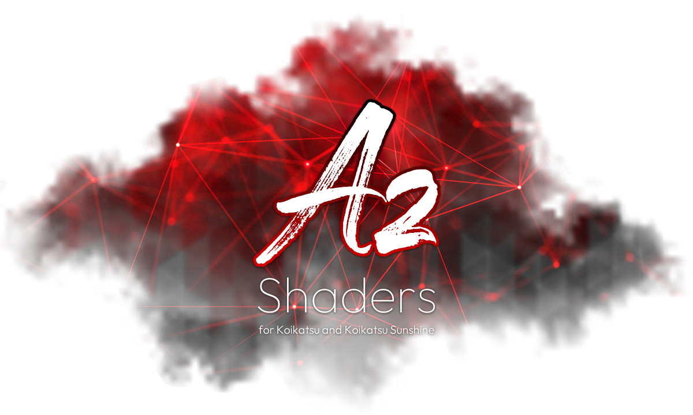

# Welcome to Az shaders document

- [Welcome to Az shaders document](#welcome-to-az-shaders-document)
  - [Live](#live)
  - [Draft](#draft)
  - [Global info](#global-info)
    - [Texture maps color space](#texture-maps-color-space)
    - [Shader keyword support](#shader-keyword-support)
  - [Tutorials](#tutorials)
  - [Notes](#notes)

This is the complete documentation for Az shaders: the shaders created by Acezen for Koikatsu and Koikatsu Sunshine.

## Live 
- [Az Standard shaders](az_standard/README.md)
- [Az Matcap shaders](az_matcap/README.md)
- [Az Fur shader](az_fur/README.md)
- [Az Planar Reflection shaders](az_planar_reflection/README.md)

You can find the mods containing these shaders on my Patreon: https://www.patreon.com/AcezenMod.

## Draft
- [Az Advanced shaders](az_advanced/README.md)

## Global info
### Texture maps color space
Since users can only import textures in gamma color space, limited by Material Editor, but many Az shaders can convert texture color space internally, that is, the textures are imported in gamma color space, but will be processed as in linear color space.

To save space and maintain a neat layout, the color space is indicated with emojis rather than listed in a separate column, using the following emojis.\
🌈: Gamma color space.\
✨: Linear color space.
 
The indication of the color space of textures is provided as a reference for users to create textures.

### Shader keyword support
You have to update your Material Editor to v3.3.0 or later to use some Az shaders without problems. This is because some Az shaders use shader keywords, which are only supported in newer versions of Material Editor. If you use these shaders in an older version of Material Editor, you may get an error that Material Editor fails and other shader mods cannot be loaded.

## Tutorials
- [How to setup ambient lighting](tutorial/how_to_setup_ambient_lighting.md)

## Notes
- If you need to view previous versions of the documents, please check the commit history.
- If you find any errors in the documents, or if you have any questions, feel free to contact me.